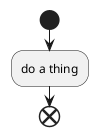
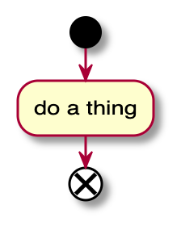

# Note Taking Tools

The note taking tools I use in my personal and professional life. This is
primarily done with VSCode and a plantuml server for flowcharting and
diagramming as needed.

## Getting Started

Start by running `bin/build-plantuml-docker-image.sh` as this will set up your
plantuml docker image for VSCode to use.

## Usage

### Commandline

#### `daily.py`

This will generate a base `daily.md` notes file in the path
`daily/YYYY/MM/DD/daily.md`. This file will be generated with a todo section,
empty if there is no previous file from the past 14 days. The todos are
generated with a format describe dbelow.

### VSCode

Tasks are created for the following:

* Make a new daily file
* Start the PlantUML server
* Stop the PlantUML server

#### Plugins

These plugins are required to make the most of this tooling

* PlantUML: `jebbs.plantuml`
* Markdown All In One: `yzhang.markdown-all-in-one`
  * This includes, particularly, github flavored markdown that lets you do
    math and checkboxes nicely

I also recommend the following

* Code Spell Checker: `streetsidesoftware.code-spell-checker`

## Note Taking

### General tips

Beyond the specific notes below (Regarding TODOs and PlantUML), it's up to you
as to how you format your notes. I personally like to section things off with H2
headers (`## <title>` in markdown) per topic, since it renders nicely in the
preview.

### TODOs

Todos to your daily notes can be added in the following format, between the
`[TODO_START]` and `[TODO_END]` blocks:

```markdown
* [ ] My in progress todo item
* [X] My completed todo item
```

When a todo item is marked as completed, it is not moved to the next generated
`daily.md` file. They are marked completed with the `X` between the square
brackets.

### PlantUML

When configured with plugins (above) in VSCode, plantuml diagrams will be
rendered out into the markdown previewer.

Ex:

````markdown

````

Becomes this in the previewer:


